# Overlay Marketing Design

Design language: **quiet control surface**.

Overlay should market itself the way the app behaves: calm, direct, neutral, fast, and demonstrative. The pages should stop explaining the category in long copy blocks and instead show the actual product loop: choose models, attach context, run tools, save workflows, govern usage, and keep work inside one controlled workspace.

## Source Mood

Reference URLs: [Aqua](https://aquavoice.com/), [Applied Intuition](https://www.appliedintuition.com/), [Context](https://context.ai/). Local reference: `Aqua Voice - Fast and Accurate Voice Dictation for Mac and Windows.html`.

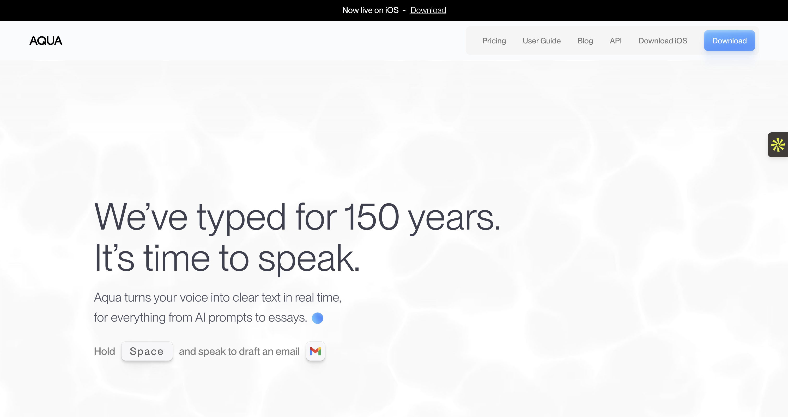

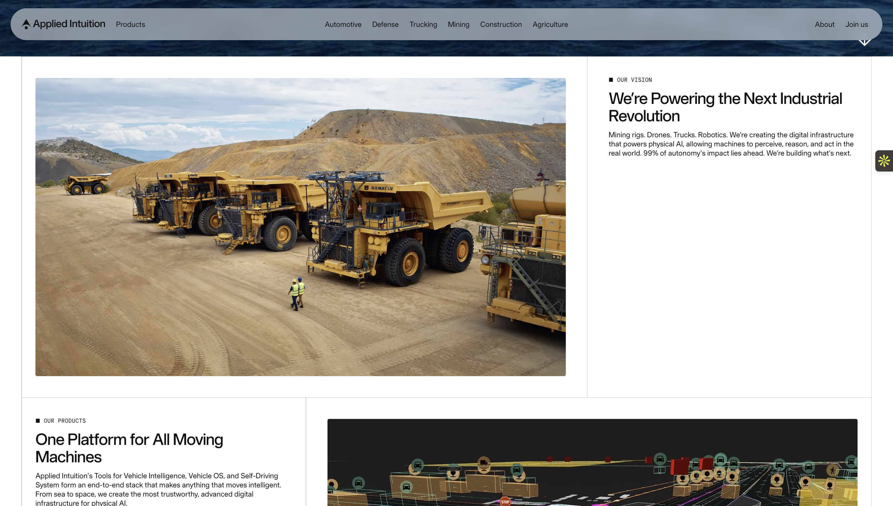

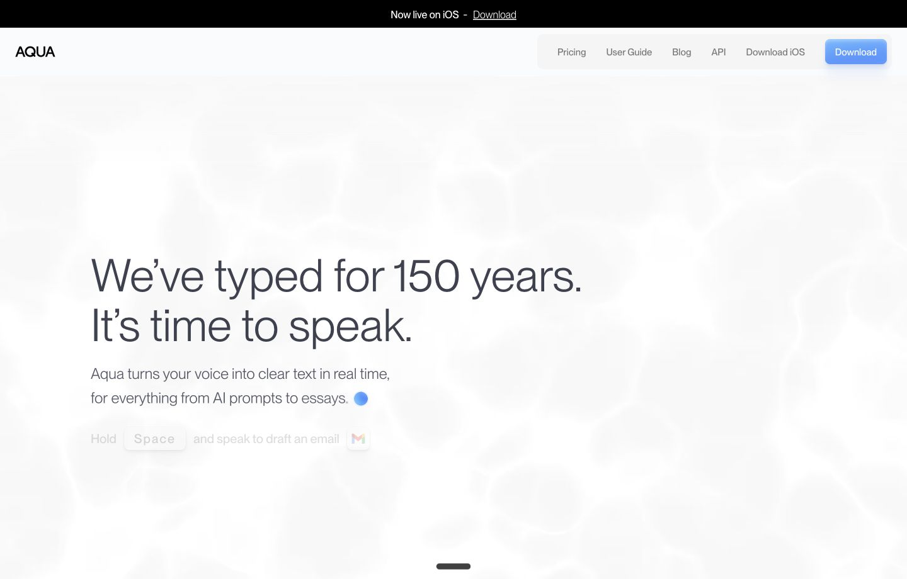

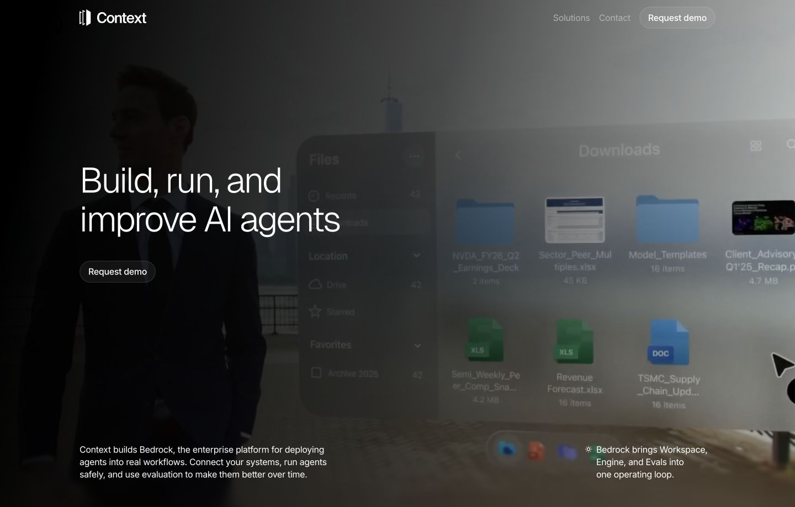

Keep from Aqua: minimal copy, soft white space, one strong product action, demonstrative first viewport.

Keep from Applied Intuition: grid discipline, image-led proof, structured sections with visible borders.

Keep from Context: enterprise seriousness, short claims, dark cinematic confidence.

Avoid copying any one site. Overlay should feel like a precise desktop product, not a Framer landing page.

## Current Overlay Evidence

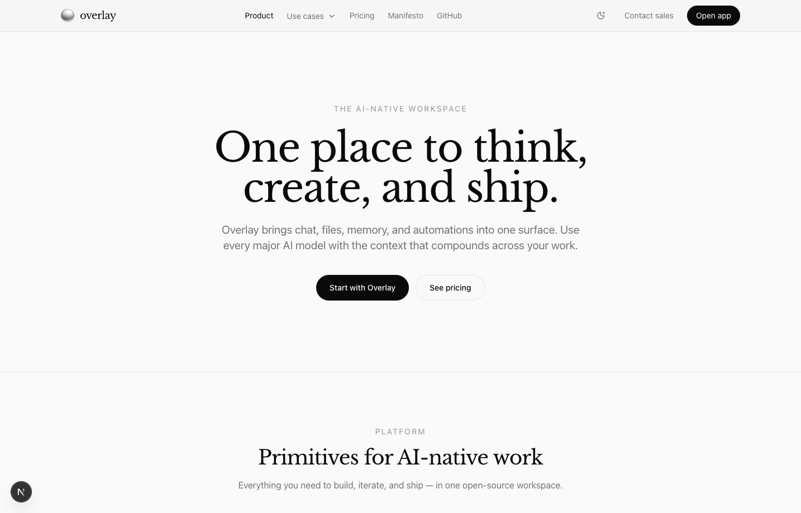

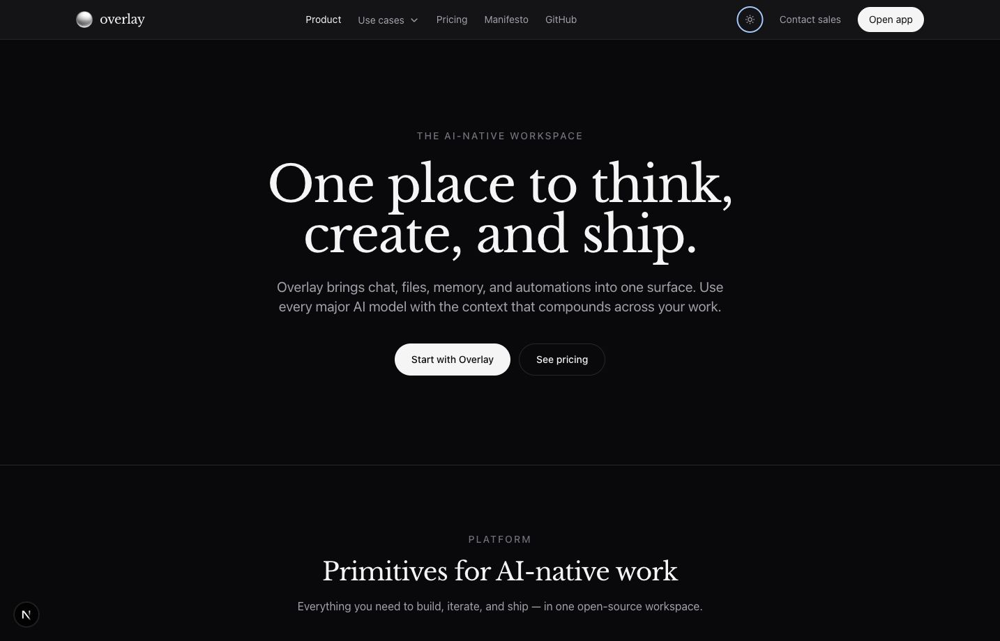

The current marketing pages match the app tokens but not the app experience. They are mostly centered copy and repeated cards. The new pages need more product surface in the first viewport.

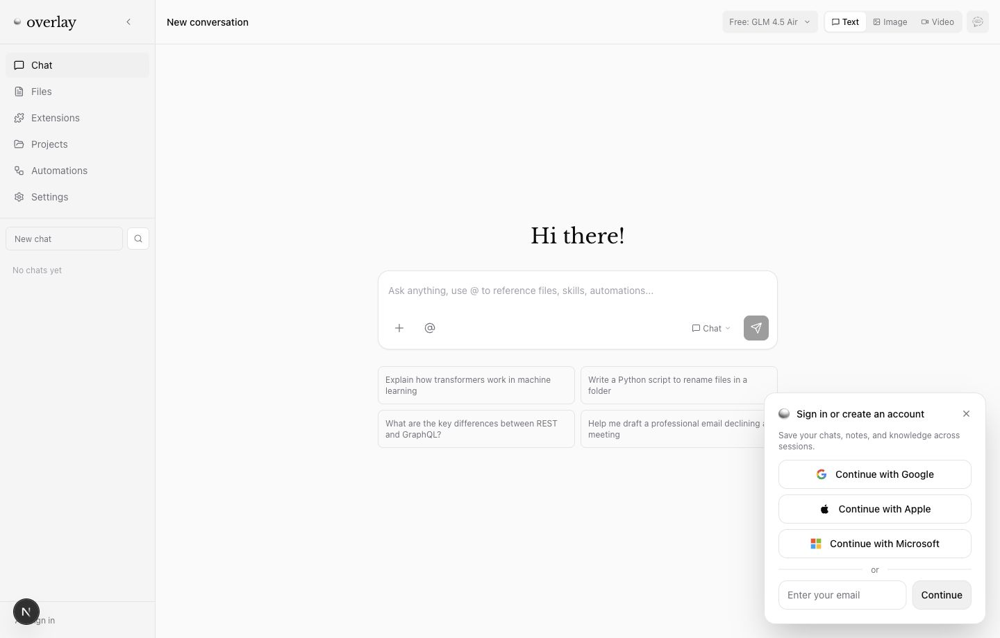

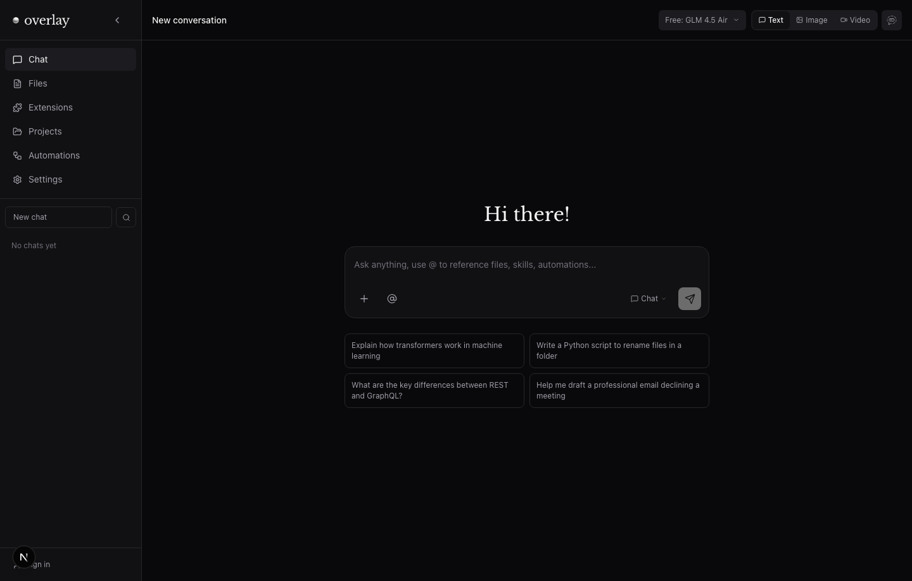

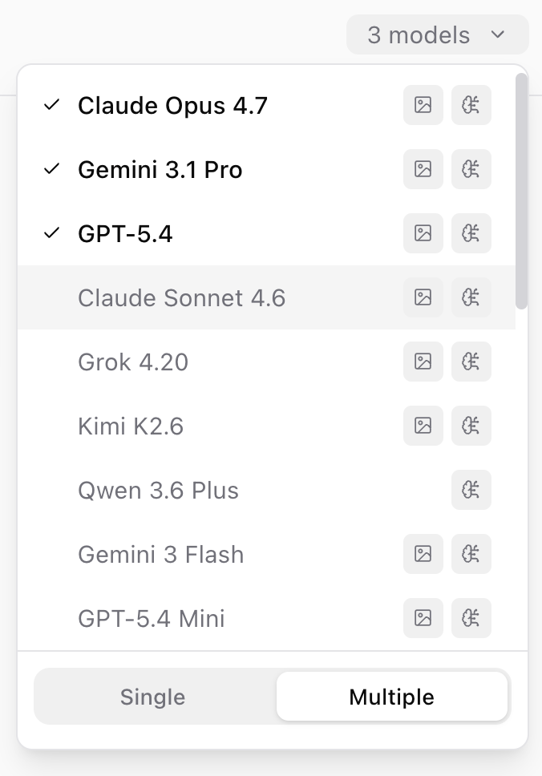

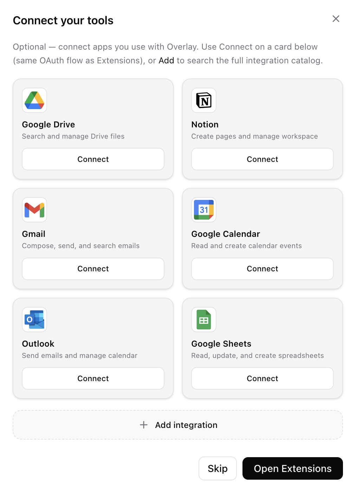

The app language to preserve:

- Neutral surfaces: `#fafafa`, `#ffffff`, `#f5f5f5`, `#09090b`, `#111113`.
- Thin dividers and borders.
- Compact controls with 8-12px radius.
- Lucide-style outline icons.
- Sparse black/white CTAs.
- Serif only as a product accent, not the full marketing voice.

## Target Concept

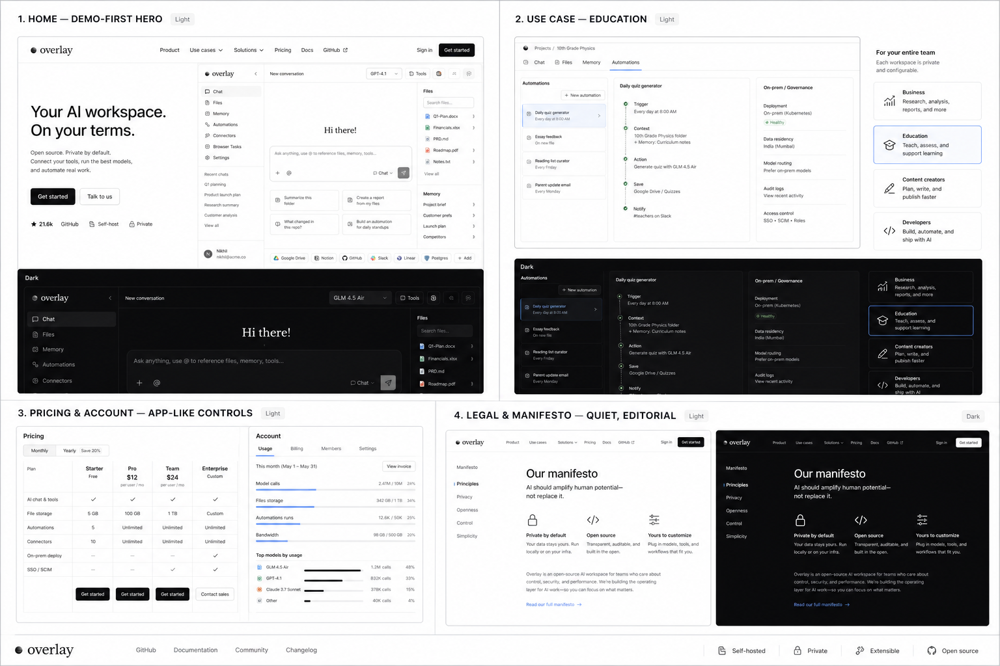

This board is directional only. Use its structure and density, not its exact generated text.

## Core Rules

- The hero must show the product. No abstract AI backgrounds, gradients, blobs, or generic dashboards.
- Copy should be sparse: one headline, one short supporting line, one primary action, one secondary action.
- Every page should include at least one real or simulated product demo component above the fold.
- Use big open whitespace plus hairline grid divisions. Do not stack large rounded marketing cards.
- Keep light mode true neutral-white, not cream.
- Keep dark mode dark gray surfaces with light text, not pure-black pages with white cards.
- Use the app's existing logo, neutral palette, and Lucide icon style.
- Use blue only as a tiny focus/active accent.

## Component Language

**Navigation**

Slim sticky bar, 56px height, product-like. Brand left, only essential links center/right. Primary CTA: `Open app`. Secondary: `Contact sales`.

**Hero Demo**

Large product surface, not a mock browser window. It can be a live component or a carefully built static demo:

- model selector
- chat composer
- file/context rail
- connector strip
- tool/automation status
- one visible output preview

**Audience Workflows**

Use one product demo per audience:

- Business: research brief + sources + browser task.
- Content: source capture + draft + generated assets.
- Developers: model routing + browser/code tool run.
- Education: teacher/student/parent/admin governance surface.

**Pricing**

Make pricing feel like account/billing UI:

- plan comparison table
- monthly budget control
- storage/usage meters
- "pay for platform + real AI usage" explanation in one compact row
- enterprise/on-prem callout as a control panel, not a banner

**Legal**

Quiet editorial layout. No decorative cards. Narrow readable column, left-side section index on desktop, clear "Last updated".

**Account**

Should feel like app settings outside the app chrome:

- usage meters
- plan status
- billing actions
- top-up settings
- account deletion in a subdued danger section

## Page Plans

Route note: this spec uses the requested `/for-*` route names. The current repo also has `/use-cases/*` pages; either add redirects/aliases or rename those routes during implementation.

### `/home`

Goal: prove Overlay is the AI workspace that does the work.

Sections:

1. Product demo hero: "Your AI workspace. On your terms."
2. Demo strip: model routing, files, memory, tools, automations.
3. Workflow gallery: research, create, automate, govern.
4. Light/dark product screenshots.
5. Open-source/private deployment proof.
6. Pricing/account preview.

Video placeholder: `[VIDEO: 45s product loop showing model selection, file reference, browser tool, saved automation]`.

### `/for-business`

Goal: sell operational leverage and governance.

Hero demo: research workspace with sources, browser task, and team memory.

Key claims:

- Replace fragmented AI subscriptions with one controlled workspace.
- Route tasks to the best model without lock-in.
- Keep internal context, workflows, and outputs in one place.

Video placeholder: `[VIDEO: market research request becomes sourced brief + follow-up automation]`.

### `/for-content`

Goal: show one creative system from idea to asset.

Hero demo: notes/files on left, draft in center, generated image/video outputs on right.

Key claims:

- Keep research, drafts, prompts, and generated assets together.
- Move from voice note to script to output without resetting context.
- Build repeatable creator workflows.

Video placeholder: `[VIDEO: creator turns sources into script, image, and publish checklist]`.

### `/for-developers`

Goal: make Overlay feel like a serious AI dev tool.

Hero demo: model routing, code sandbox, browser task, MCP connector.

Key claims:

- Use live tools, not text-only chat.
- Build custom MCPs/connectors.
- Open source, extensible, self-hostable.

Video placeholder: `[VIDEO: bug investigation using browser, files, code sandbox, and model switch]`.

### `/for-education`

Goal: adapt the JPGS proposal into a polished school page.

Hero demo: school-controlled workspace with teacher, student, parent, and admin views.

Key claims from the proposal:

- Govern AI use instead of leaving it to personal accounts.
- Help teachers with assessments, rubrics, feedback, and resources.
- Give students personalized practice, revision plans, and visual explanations.
- Give parents approved visibility without raw surveillance.
- Give admins adoption, governance, and ROI visibility.
- Support private/on-prem deployment and ZDR model policy.

Video placeholder: `[VIDEO: teacher creates worksheet, student gets practice plan, admin sees governed usage]`.

### `/manifesto`

Goal: high-trust editorial page, not a feature grid.

Structure:

1. Short manifesto headline.
2. Four principles: private by default, open source, model choice, context compounds.
3. One product screenshot showing the principle in action.
4. Link to GitHub and app.

### `/pricing`

Goal: make pricing transparent and less SaaS-seat-like.

Structure:

1. Pricing control surface above fold.
2. Free, paid, choose-my-own budget.
3. Usage meter preview.
4. Cost philosophy: platform fee + actual AI usage.
5. Enterprise/on-prem note.

### `/privacy` and `/terms`

Goal: readable, serious, plain-language legal pages.

Structure:

1. Header with title and last updated date.
2. Left index on desktop.
3. Sections as simple bordered rows.
4. Contact link.

### `/account`

Goal: protected billing/settings page outside app chrome, visually aligned with app settings.

Structure:

1. Account summary.
2. Current plan and billing actions.
3. Usage and top-up controls.
4. Connected auth/deep-link status.
5. Danger section.

## Copy System

Use short, concrete sentences.

Preferred claims:

- "One workspace for models, files, memory, tools, and automations."
- "Private by default. Open source. Yours to extend."
- "Pay for the platform and the AI you actually use."
- "Govern AI use without slowing people down."

Avoid:

- "AI-native" repeated more than once per page.
- Long paragraphs above the fold.
- Fake metrics unless backed by real data.
- Generic "unlock productivity" phrasing.

## Implementation Notes

- Reuse existing theme tokens from `globals.css` and `LandingThemeContext`.
- Prefer shared marketing components under `src/features/marketing/components`.
- Replace audience card grids with route-specific demo components.
- Screenshots should be real app captures where possible. Use generated/video placeholders only for planned product moments that need recording.
- If a demo is static, build it as code-native UI so text, controls, and responsive behavior remain crisp.

## Verification Checklist

- Desktop and mobile screenshots for every marketing route.
- Light and dark screenshots for `/home`, `/pricing`, and product demo components.
- No text overlap at 390px width.
- No nested cards inside cards.
- No decorative blobs, orbs, or generic AI gradients.
- CTA and nav labels fit in the first viewport.
- Product screenshots load and retain aspect ratio.
- Legal pages remain readable in dark mode.
