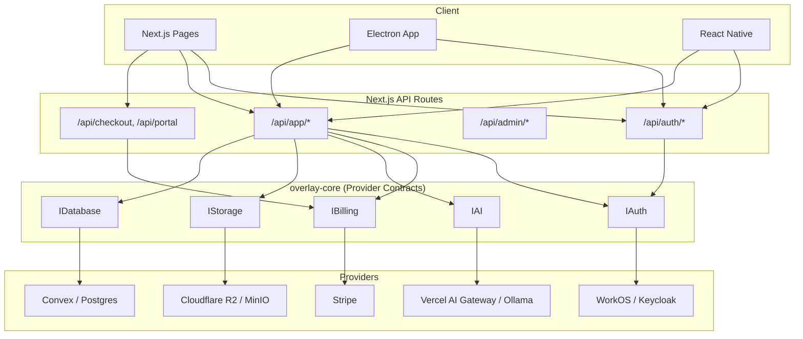

# Architecture

Overlay is a Next.js application with a provider-based backend architecture. Every domain (auth, billing, AI, storage) is abstracted behind an interface so you can swap implementations without touching business logic.

## System Diagram



## Provider Interface Model

The canonical interface definitions live in `packages/overlay-core/src/`:

| Interface | File | Responsibility |
|-----------|------|----------------|
| `IAuth` | `auth/interface.ts` | Session resolution, role checks, token refresh |
| `IBilling` | `billing/interface.ts` | Entitlements, usage recording, subscriptions |
| `IAI` | `ai/interface.ts` | Model listing, inference, cost estimation |
| `IStorage` | `storage/interface.ts` | Presigned URLs, upload/download, bucket management |
| `IDatabase` | `db/interface.ts` | Queries, mutations, transactions |

### Example: Swapping Auth Providers

```typescript
// packages/overlay-core/src/factory.ts
import type { IAuth } from './auth/interface'

export function createAuthProvider(): IAuth {
  // Swap this line to change auth backends
  return new WorkOSAuthProvider()
  // return new KeycloakAuthProvider()
  // return new SAMLAuthProvider()
}
```

## Data Flow

### Authentication

1. Client calls `POST /api/auth/sign-in` (or SAML redirect)
2. `withAuth` middleware resolves the session via `IAuth.resolveSession()`
3. Session is stored in Redis (self-hosted) or Convex (SaaS)
4. Subsequent requests carry a signed `overlay_session` cookie

### AI Inference

1. Client calls `POST /api/app/conversations/ask`
2. Route handler validates auth + budget via `IBilling.checkBudget()`
3. `IAI.generate()` streams tokens through the AI gateway
4. Usage is recorded via `IBilling.recordUsage()`
5. Cost is deducted from the user's budget in real time

### File Upload

1. Client calls `GET /api/app/files/presign`
2. `IStorage.getPresignedUploadUrl()` returns a time-limited URL
3. Client uploads directly to the storage backend (R2, MinIO, S3)
4. Metadata is persisted in the database layer

## Deployment Modes

| Mode | Database | Auth | Storage | AI | Best For |
|------|----------|------|---------|----|----------|
| **SaaS (Current)** | Convex | WorkOS | Cloudflare R2 | Vercel AI Gateway | Public product |
| **Self-Hosted** | Postgres | Keycloak / SAML | MinIO | Ollama / vLLM | Air-gapped enterprise |
| **Hybrid** | Convex | WorkOS | MinIO | Vercel AI Gateway | Data residency requirement |

## Source of Truth Rules

1. The Next.js API is the canonical contract. Never bypass it.
2. `packages/overlay-core` defines interfaces, not implementations.
3. Every provider implementation lives in `src/lib/providers/<domain>/`.
4. Convex is treated as an implementation detail, not a public API.
